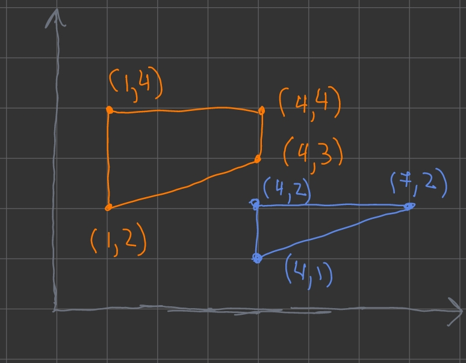
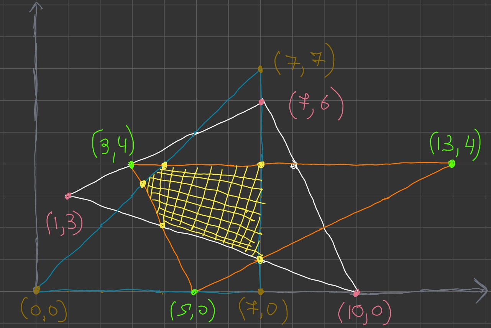
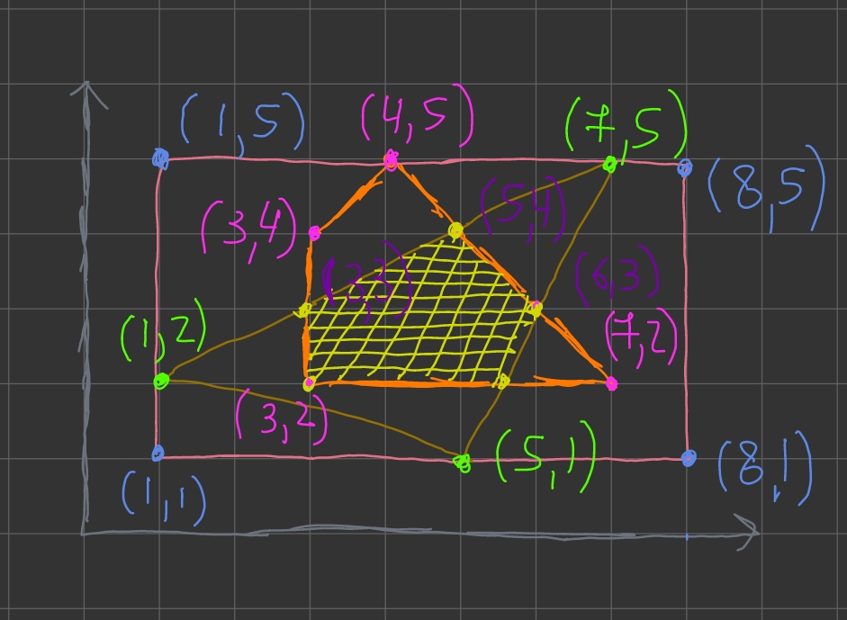
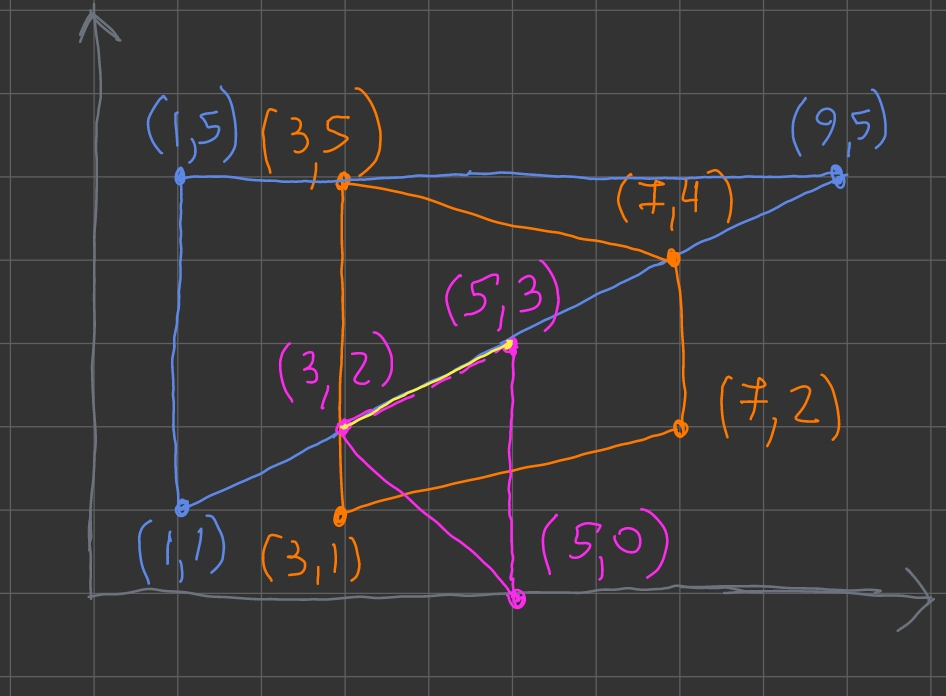
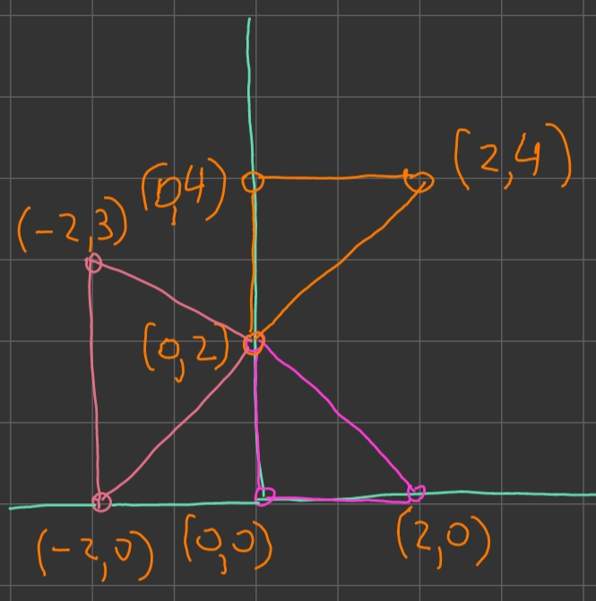

# Пересечение многоугольников

## Описание

Программа main.cpp выводит результат пересечения нескольких выпуклых многоуольников, а именно:
- точки пересечения,
- площадь пересечения.

## Запуск

1. Скачайте репозиторий
```
git clone https://github.com/shozh/polygon_intersection.git
cd polygon_intersection
```

3. Введите свои данные в input.txt
```plain
n = Количество многоугольников
точки многоугольников в n строках
```

2. Запуск программы
```
clang++ -std=c++23 main.cpp r.cpp segline.cpp convex_polygon.cpp -o main && ./main
```

## Тесты

1.


input.txt
```cpp
2
(1, 2) (1, 4) (4, 3) (4, 4)
(4, 1) (4, 2) (7, 2)
```
Вывод:
```plain
Нет пересечения!
```

2.


input.txt
```cpp
3
(0, 0) (7, 0) (7, 7)
(3, 4) (5, 0) (13, 4)
(1, 3) (10, 0) (7, 6)
```

Вывод:
```plain
Точки персечения: (3.333, 3.333); (4, 4); (7, 4); (7, 1); (4, 2); 
Площадь пересечения: 8.167.
```


3.


input.txt
```cpp
3
(1, 1) (8, 1) (8, 5) (1, 5)
(1, 2) (5, 1) (7, 5)
(3, 2) (3, 4) (7, 2) (4, 5)
```

Вывод:
```plain
Точки персечения: (3, 2); (3, 3); (5, 4); (6, 3); (5.5, 2); 
Площадь пересечения: 4.25.
```

4. 


input.txt
```cpp
3
(1, 1) (9, 5) (1, 5)
(3, 1) (3, 5) (7, 2)
(3, 2) (5, 3) (5, 0)
```

Вывод:

```plain
Точки персечения: (3, 2); (5, 3); 
Длина пересечения: 2.236.
```

5.


input.txt
```cpp
3
(-2, 0) (0, 2) (-2, 3)
(0, 0) (2, 0) (0, 2)
(0, 2) (0, 4) (2, 4)
```

Вывод:

```plain
Точка пересечения: (0, 2)
```